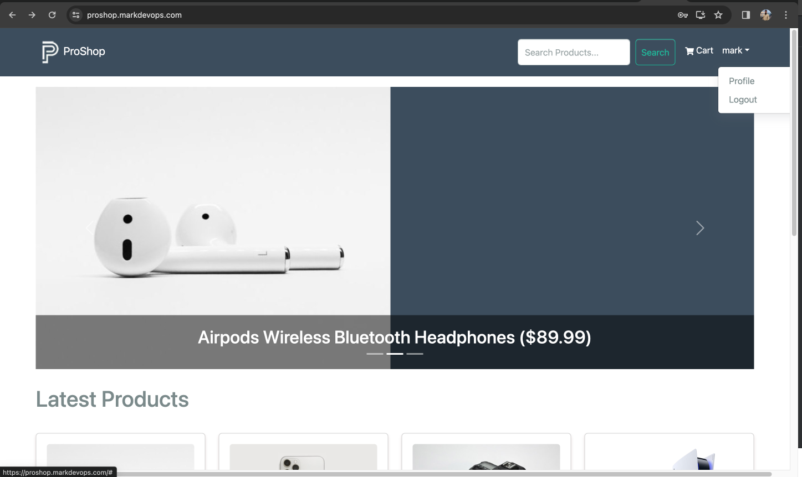
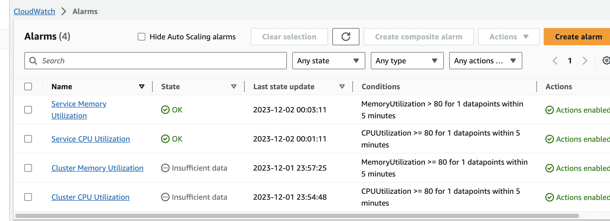

# ProShop eCommerce Platform - Mark Version

Step 1

Create Dockerfile

```
# Use the official Node.js image as the base image
FROM node:lts

# Set working directory
WORKDIR /app

# Copy package.json and package-lock.json to the working directory
COPY package*.json ./

# Install app dependencies
RUN npm install

# Change the working directory to the frontend directory
WORKDIR /app/frontend

# Copy the frontend package.json and package-lock.json files to the frontend working directory
COPY frontend/package*.json ./

# Install frontend dependencies
RUN npm install

# Change the working directory back to the main app directory
WORKDIR /app

# Copy the rest of the application code
COPY . .

# Build the React app
RUN npm run build

# Expose port 5000 to the outside world (adjust if needed)
EXPOSE 9000

# Command to run your application
CMD ["npm", "start"]

RUN npm run data:import

```

Step 2

Create MongoDB Cloud Instance
Edit Environment Variables


Step 3

Install AWS copilot

Step 4

Initialize copilot app
This will copilot directory and initial manifest file

```
copilot init

```
and fill up the following

```
copilot init
Welcome to the Copilot CLI! We're going to walk you through some questions
to help you get set up with a containerized application on AWS. An application is a collection of
containerized services that operate together.

Application name: proshop
Workload type: Load Balanced Web Service
Service name: proshop
Dockerfile: ./Dockerfile
Ok great, we'll set up a Load Balanced Web Service named proshop in application proshop.

✔ Proposing infrastructure changes for stack proshop-infrastructure-roles
- Creating the infrastructure for stack proshop-infrastructure-roles                            [create complete]  [51.8s]
  - A StackSet admin role assumed by CloudFormation to manage regional stacks                   [create complete]  [20.4s]
  - An IAM role assumed by the admin role to create ECR repositories, KMS keys, and S3 buckets  [create complete]  [17.6s]
✔ The directory copilot will hold service manifests for application proshop.

Note: Architecture type arm64 has been detected. We will set platform 'linux/x86_64' instead. If you'd rather build and run as architecture type arm64, please change the 'platform' field in your workload manifest to 'linux/arm64'.
✔ Wrote the manifest for service proshop at copilot/proshop/manifest.yml
Your manifest contains configurations like your container size and port.

- Update regional resources with stack set "proshop-infrastructure"  [succeeded]  [0.0s]
All right, you're all set for local development.
Deploy: Yes
Only found one option, defaulting to: Create a new environment
Environment name: proshop
Environment proshop does not yet exist in application proshop; initializing it.
✔ Wrote the manifest for environment proshop at copilot/environments/proshop/manifest.yml
- Update regional resources with stack set "proshop-infrastructure"  [succeeded]  [0.0s]
- Update regional resources with stack set "proshop-infrastructure"  [succeeded]           [155.9s]
  - Update resources in region "ap-southeast-1"                      [create complete]     [154.2s]
    - KMS key to encrypt pipeline artifacts between stages           [create complete]     [121.1s]
    - ECR container image repository for "proshop"                   [create complete]     [2.1s]
    - S3 Bucket to store local artifacts                             [create in progress]  [3.6s]
✔ Proposing infrastructure changes for the proshop-proshop environment.
- Creating the infrastructure for the proshop-proshop environment.  [create complete]  [58.3s]
  - An IAM Role for AWS CloudFormation to manage resources          [create complete]  [20.8s]
  - An IAM Role to describe resources in your environment           [create complete]  [25.4s]
✔ Provisioned bootstrap resources for environment proshop in region ap-southeast-1 under application proshop.
✔ Provisioned bootstrap resources for environment proshop.
✔ Proposing infrastructure changes for the proshop-proshop environment.
- Creating the infrastructure for the proshop-proshop environment.                     [update complete]  [203.7s]
  - An ECS cluster to group your services                                              [create complete]  [6.8s]
  - A security group to allow your containers to talk to each other                    [create complete]  [3.7s]
  - An Internet Gateway to connect to the public internet                              [create complete]  [15.0s]
  - A resource policy to allow AWS services to create log streams for your workloads.  [create complete]  [0.0s]
  - Private subnet 1 for resources with no internet access                             [create complete]  [2.7s]
  - Private subnet 2 for resources with no internet access                             [create complete]  [2.7s]
  - A custom route table that directs network traffic for the public subnets           [create complete]  [11.9s]
  - Public subnet 1 for resources that can access the internet                         [create complete]  [2.7s]
  - Public subnet 2 for resources that can access the internet                         [create complete]  [2.7s]
  - A private DNS namespace for discovering services within the environment            [create complete]  [46.1s]
  - A Virtual Private Cloud to control networking of your AWS resources                [create complete]  [9.6s]
✔ Successfully deployed environment proshopLogin Succeeded
[+] Building 252.3s (16/16) FINISHED                                                          docker:desktop-linux
 => [internal] load .dockerignore                                                                             0.0s
 => => transferring context: 2B                                                                               0.0s
 => [internal] load build definition from Dockerfile                                                          0.0s
 => => transferring dockerfile: 851B                                                                          0.0s
 => [internal] load metadata for docker.io/library/node:lts                                                   0.9s
 => [ 1/11] FROM docker.io/library/node:lts@sha256:445acd9b2ef7e9de665424053bf95652e0b8995ef36500557d48faf29  0.0s
 => [internal] load build context                                                                             0.0s
 => => transferring context: 18.71kB                                                                          0.0s
 => CACHED [ 2/11] WORKDIR /app                                                                               0.0s
 => CACHED [ 3/11] COPY package*.json ./                                                                      0.0s
 => CACHED [ 4/11] RUN npm install                                                                            0.0s
 => CACHED [ 5/11] WORKDIR /app/frontend                                                                      0.0s
 => CACHED [ 6/11] COPY frontend/package*.json ./                                                             0.0s
 => CACHED [ 7/11] RUN npm install                                                                            0.0s
 => CACHED [ 8/11] WORKDIR /app                                                                               0.0s
 => [ 9/11] COPY . .                                                                                          0.4s
 => [10/11] RUN npm run build                                                                               241.9s
 => [11/11] RUN npm run data:import                                                                           8.5s
 => exporting to image                                                                                        0.4s 
 => => exporting layers                                                                                       0.4s 
 => => writing image sha256:14efb7af77362f551a9c62111d6d676e849b1e7aea187e5d38c4552b53a62432                  0.0s 
 => => naming to 359019294801.dkr.ecr.ap-southeast-1.amazonaws.com/proshop/proshop:latest                     0.0s 
                                                                                                                   
What's Next?
  View a summary of image vulnerabilities and recommendations → docker scout quickview
The push refers to repository [359019294801.dkr.ecr.ap-southeast-1.amazonaws.com/proshop/proshop]
028853799f06: Pushed 
d370059dbc5c: Pushed 
4bd970b91fda: Pushed 
5f70bf18a086: Layer already exists 
2f1beff9d133: Layer already exists 
b152babed9ac: Layer already exists 
9ae1a5d0331b: Layer already exists 
35da3744e67c: Layer already exists 
e237f47a1b29: Layer already exists 
60ba0ba2c558: Layer already exists 
e471edff4937: Layer already exists 
7973049f41b5: Layer already exists 
f48a36f74def: Layer already exists 
652b81616682: Layer already exists 
80bd043d4663: Layer already exists 
30f5cd833236: Layer already exists 
7c32e0608151: Layer already exists 
7cea17427f83: Layer already exists 
latest: digest: sha256:6292616946451bcc3fca7c52c19db661435aa15e3dbe1b823b3cbcdf50e22d80 size: 4097
✔ Proposing infrastructure changes for stack proshop-proshop-proshop
- Creating the infrastructure for stack proshop-proshop-proshop                   [create complete]     [403.2s]
  - Service discovery for your services to communicate within the VPC             [create complete]     [0.0s]
  - Update your environment's shared resources                                    [update complete]     [173.4s]
    - A security group for your load balancer allowing HTTP traffic               [create complete]     [7.6s]
    - An Application Load Balancer to distribute public traffic to your services  [create complete]     [153.6s]
    - A load balancer listener to route HTTP traffic                              [create in progress]  [200.6s]
  - An IAM role to update your environment stack                                  [create complete]     [15.9s]
  - An IAM Role for the Fargate agent to make AWS API calls on your behalf        [create complete]     [18.4s]
  - An HTTP listener rule for path `/` that forwards HTTP traffic to your tasks   [create complete]     [0.0s]
  - A custom resource assigning priority for HTTP listener rules                  [create complete]     [5.6s]
  - A CloudWatch log group to hold your service logs                              [create complete]     [0.0s]
  - An IAM Role to describe load balancer rules for assigning a priority          [create complete]     [15.9s]
  - An ECS service to run and maintain your tasks in the environment cluster      [create complete]     [162.6s]
    Deployments                                                                                         
               Revision  Rollout      Desired  Running  Failed  Pending                                          
      PRIMARY  3         [completed]  1        1        0       0                                                
  - A target group to connect the load balancer to your service on port 9000      [create complete]     [14.8s]
  - An ECS task definition to group your containers and run them on ECS           [create complete]     [0.0s]
  - An IAM role to control permissions for the containers in your tasks           [create complete]     [18.4s]
✔ Deployed service proshop.
Recommended follow-up action:
  - Your service is accessible at  https://proshop.markdevops.com  over the internet.
- Be a part of the Copilot ✨community✨!
  Ask or answer a question, submit a feature request...
  Visit 👉 https://aws.github.io/copilot-cli/community/get-involved/ to see how!

```

Step 5

Edit Network Access of MongoDB Instance


Step 6

Create Route53 Hosted Zone

Create Record "proshop.markdevops.com" pointing to the generated LoadBalancer Endpoint

http://prosho-Publi-r2nHMCiARTOy-499596279.ap-southeast-1.elb.amazonaws.com

Step 7

Test Register and Login



Step 8

Create DashBoard and Alarms in CloudWatch 
Create SNS Topic for Notifications

    Cluster
        - CPUUtilization
        - MemoryUtulization

    Service
        - CPUUtilization
        - MemoryUtulization


Step 9

Create CI/CD    Pipiline


